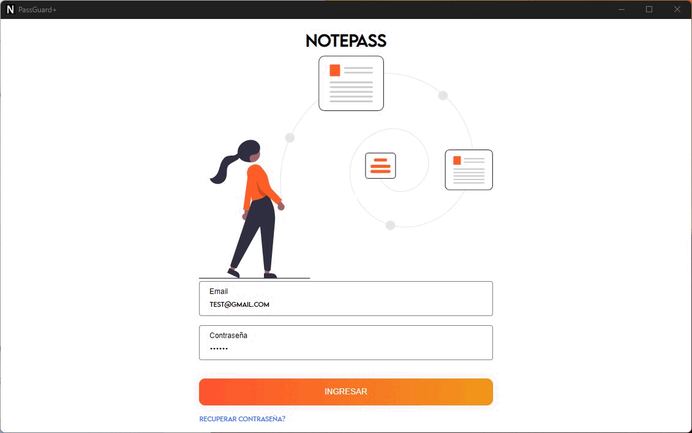

# 🔒 Ionic-Tauri-Capacitor-Firebase 🔑

¡Bienvenido/a a esta aplicación de Ionic, Tauri y Capacitor! Esta app te permite guardar notas y contraseñas de forma segura en Firebase.

## 📱 Capturas de pantalla 🚀



## Requisitos previos

Antes de comenzar a utilizar la aplicación, se necesitan los siguientes requisitos previos:

- Node.js
- Ionic CLI
- Angular CLI
- Capacitor CLI
- Tauri
- Webview 2
- Instalación y configuración
- Para instalar y configurar la aplicación, siga estos pasos:

1. Clone este repositorio.

2. Abra una terminal en la carpeta raíz del proyecto y ejecute el siguiente comando para instalar las dependencias:

```sh
npm install
```

3. Cree una cuenta en Firebase y cree un proyecto.
4. En el panel de Firebase, agregue una aplicación web y copie las credenciales de Firebase.
5. Cree un archivo environment.ts en la carpeta src/environments y agregue las siguientes líneas de código:

```sh
export const environment = {
  production: false,
  firebase: {
    apiKey: '<tu_api_key>',
    authDomain: '<tu_auth_domain>',
    databaseURL: '<tu_database_url>',
    projectId: '<tu_project_id>',
    storageBucket: '<tu_storage_bucket>',
    messagingSenderId: '<tu_messaging_sender_id>',
    appId: '<tu_app_id>'
  }
};

```

7. Ejecute el siguiente comando para iniciar a desarollar !!

```sh
npm run tauri dev
```
